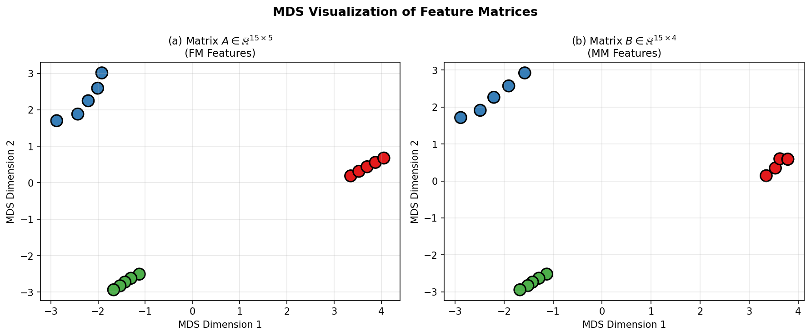
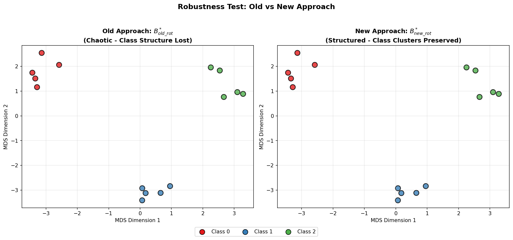
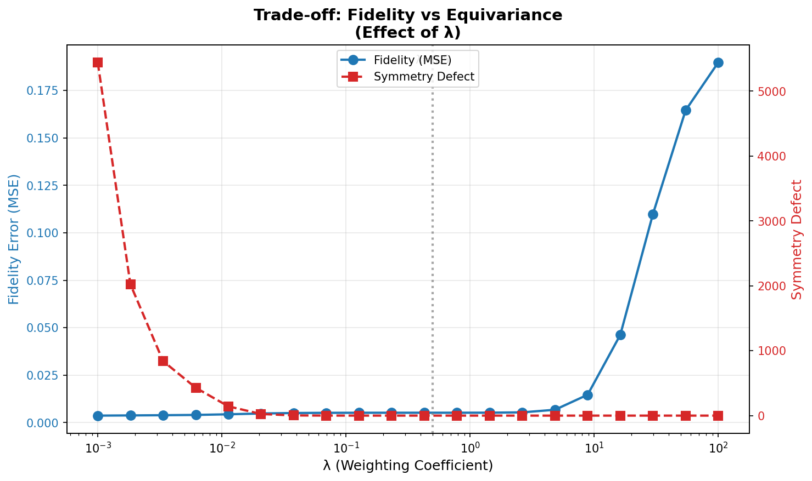
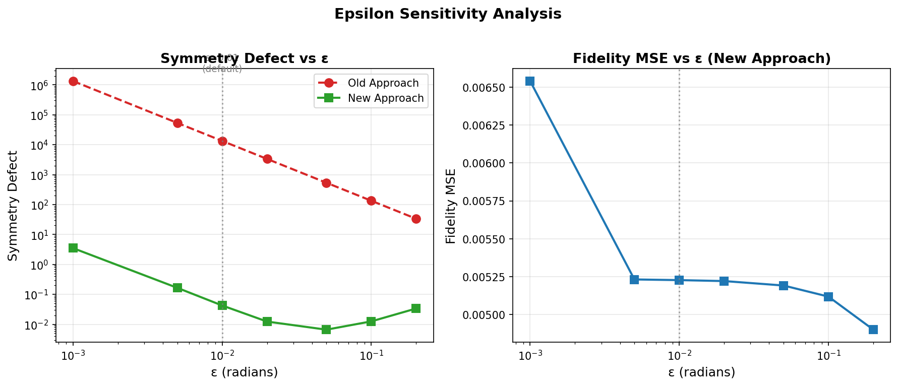

# Equivariant Transition Matrices for Explainable Deep Learning

This repository contains a reproduction of the paper **"Equivariant Transition Matrices for Explainable Deep Learning: A Lie Group Linearization Approach"**. It implements a novel method for computing transition matrices that preserve the symmetry properties (equivariance) of the underlying data manifolds, leading to more robust and interpretable explanations.

## 📊 Results & Analysis

Our computational experiments confirm the core hypothesis: enforcing equivariance yields transition matrices that are significantly more robust to distributional shifts (generative factors) like rotation, with minimal trade-off in reconstruction fidelity.

### 1. Data Manifold Visualization

The synthetic experiment confirms that the input (Formal Model) and output (Mental Model) feature spaces possess a clear, recoverable manifold structure. Figure 1 visually demonstrates these spaces using Multi-Dimensional Scaling (MDS), revealing distinct class clusters.


*Figure 1: MDS visualization of the Formal Model (A) and Mental Model (B) matrices. The underlying class structure used for Synthetic Scenarios is clearly visible.*

### 2. Robustness to Transformations

The most critical finding is visually demonstrated below. When the input data is rotated (simulating a change in generative factors), the **Old Approach** (baseline) fails to map samples coherently, scattering class clusters. The **New Equivariant Approach**, however, preserves the geometric structure of the classes.


*Figure 2: Comparison of robustness under SO(2) rotation. The equivariant approach (right) maintains class separability, whereas the baseline (left) loses structure.*

### 3. Fidelity vs. Equivariance Trade-off

We analyzed the effect of the weighting parameter $\lambda$ (lambda) which balances the fidelity term (MSE) and the symmetry constraint. As predicted, increasing $\lambda$ dramatically reduces the symmetry defect (error in commutativity with the group action) while only slightly increasing the reconstruction error.


*Figure 3: The trade-off between Fidelity (MSE) and Symmetry Defect. $\lambda=0.5$ offers an optimal balance point.*

### 4. Generator Estimation Stability ($\epsilon$-Sensitivity)

To implement the Lie algebra linearization, we estimate generators using finite differences with step size $\epsilon$. Our sensitivity analysis shows a stable operating range typically between $\epsilon=0.01$ and $\epsilon=0.05$ radians. Outside this range, numerical instability (too small $\epsilon$) or linearization error (too large $\epsilon$) degrades performance.


*Figure 4: Sensitivity of the method to the finite difference step size $\epsilon$. The equivariant approach (New) consistently minimizes symmetry defect across the stable range.*

### 5. Quantitative Results (MNIST Experiment)

We extended the evaluation to an image-based task using the MNIST dataset. A transition matrix was learned to map from a CNN's intermediate features (Formal Model) to the pixel space (Mental Model). We evaluated robustness by rotating the test set images.

**Experiment Settings:** $n=1000$ samples, 5 epochs training.

| Metric | Old Approach (Baseline) | New Approach (Equivariant) | Improvement |
| :--- | :--- | :--- | :--- |
| **Robustness MSE** | 0.838 | **0.471** | **1.78x Lower Error** |
| **SSIM** | 0.199 | **0.331** | **1.66x Higher Similarity** |
| **PSNR** | 10.54 dB | **12.61 dB** | **+2.07 dB** |

The equivariant method produces significantly better reconstructions under rotation, as evidenced by the **+2 dB** gain in PSNR and substantial improvement in Structural Similarity Index (SSIM).

## 🛠️ Installation

```bash
pip install -r requirements.txt
```

**Requirements:** `numpy`, `scipy`, `matplotlib`, `scikit-learn`, `torch`, `torchvision` (for MNIST).

## 🚀 Usage

### Run Synthetic Experiments

To reproduce Figures 1-4 and the synthetic data methodology:

```bash
python experiments/synthetic/run_experiment.py --validate
```

### Generate Figures

To regenerate all plots found in this README:

```bash
python scripts/generate_figures.py --output figures/
python scripts/epsilon_sensitivity.py
```

### Run MNIST Experiment

To retrain the model and run the deep learning evaluation (requires PyTorch):

```bash
python experiments/mnist/run_experiment.py --samples 1000 --epochs 5
```

## 📂 Project Structure

- `src/`: Core implementation of the algorithm.
  - `equivariant.py`: The main solver implementing Eq. (12) from the paper.
  - `generators.py`: Lie algebra generator estimation (Algorithm 2).
  - `baseline.py`: Standard least-squares transition matrix.
- `experiments/`: Experiment runners.
  - `synthetic/`: Reproduction of the synthetic manifold experiment.
  - `mnist/`: Deep learning application experiment.
- `scripts/`: Visualization and analysis tools.

## 🧪 Testing

The codebase includes a comprehensive test suite covering algebraic identities and solver correctness.

```bash
python -m pytest tests/ -v
```
